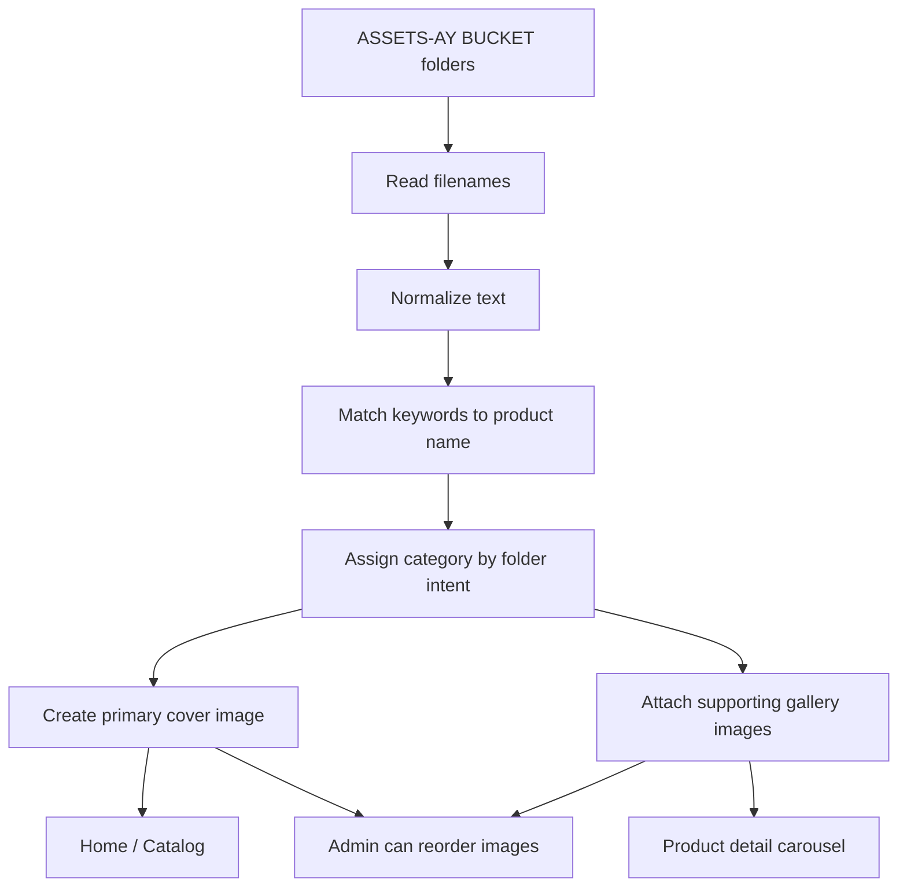

# Asset Roadmap - AY Bucket & Gift

## Overview

- **Folders:** 21
- **Total assets:** 127
- **Products:** 36
- **Goal:** every product must have one primary image and as many supporting assets as possible without wrong category placement.

## Matching Flow

## Folder to Category Guide

| Folder | Main Category | Notes |
|---|---|---|
| Akrilik frame mini | Accessories | A5 acrylic dome frame, LED photo frame |
| Standing Akrilik | Accessories | Stand display, round/dome/variant shapes |
| Sewa Standing Akrilik (PROMO) | Accessories | Promotional rental tier |
| Sewa Per Jam Standing Akrilik Bulat | Accessories | Hourly rental variants |
| Frmae Birthday Edelweis | Accessories | Birthday frame / photo gift |
| Selempang Wisuda 3 Titik | Ribbons & Sashes | Graduation sash variants |
| Selempang List Pita | Ribbons & Sashes | Ribbon sash accessory |
| Buket Cilla Estetik Mesh | Artificial Flower | Premium mesh bouquet |
| Buket skripsi glitter 20 tangkai | Artificial Flower | Graduation bouquet |
| Bucket Bunga Gradoll (Graduation Doll) Big Mesh | Artificial Flower | Graduation doll bouquet |
| Bucket Aesthetic | Buckets | Satin / round aesthetic bouquet |
| Bucket Bunga Mawar Medium | Fresh Flower | Fresh rose bouquet |
| Bunga Mawar Palsu | Artificial Flower | Artificial rose bouquet |
| Bunga White Sedap | Fresh Flower | Fresh flower bouquet |
| Donat Bucket Tart | Money Bouquet | Sweet gift bouquet |
| Karangan Bunga | Wreaths | Flower board / papan ucapan |
| Luxury Bucket | Fresh Flower | Premium luxury bucket |
| Mawar Candy (Bunga Asli) | Fresh Flower | Fresh rose candy bouquet |
| packing Luxury Elegant | Packaging | Premium gift wrapping |
| Peony Rose Medium | Artificial Flower | Premium peony bouquet |
| Rose Gonie Pink | Artificial Flower | Artificial rose bouquet |

## What the app does now

1. Reads product names from the catalog source.
2. Normalizes asset filenames and product keywords.
3. Picks the best matching assets from the correct folder.
4. Uses the first matched image as the **cover**.
5. Adds the rest to the **detail carousel**.
6. Lets admin change the cover by reordering thumbnails.
7. Falls back safely if an image fails to load.

## Admin Rules

- The **first image** in a product is the main display image.
- Clicking **●** on a thumbnail moves it to the front.
- Uploading new images appends them to the product gallery.
- The About / Footer / Navbar logo can be changed from admin settings.

## Quality Target

- No blank cards.
- No wrong folder-to-category placement.
- No missing product images.
- Every product should have multiple images when the folder provides them.
